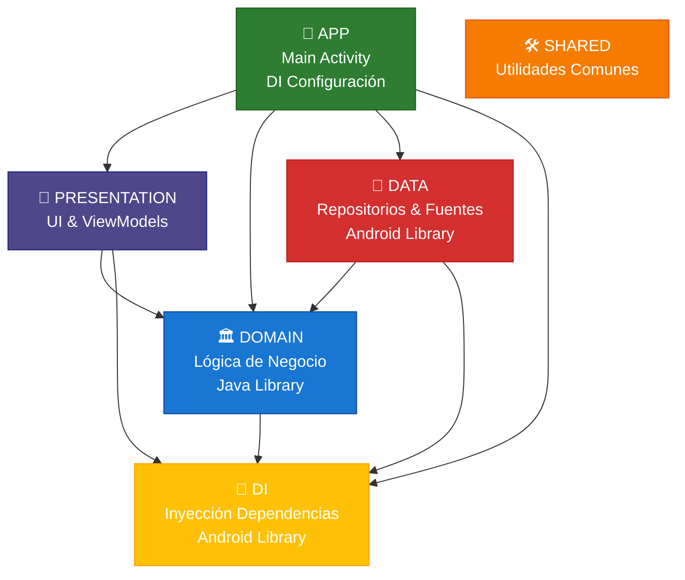

<div align="center">

# Opositate 🎓

<!-- Kotlin -->


<!-- Firebase -->


<!-- Android -->


<!-- Architecture -->


<!-- Tools -->


<!-- License -->


**Una aplicación Android avanzada para la preparación de pruebas psicotécnicas en oposiciones**

*Actualmente en desarrollo con sistema de autenticación ya implementado. Próximas funciones en desarrollo: entrenamiento adaptativo, contenido estructurado, seguimiento de progreso y planificación inteligente para ayudarte a aprobar tus oposiciones.*

</div>

---

## 📌 Índice

- [🌟 Descripción General](#-descripción-general)
- [🏗️ Arquitectura](#-arquitectura)
- [📊 Estado Actual del Proyecto](#-estado-actual-del-proyecto)
- [🚀 Primeros Pasos](#-primeros-pasos)
- [🔧 Configuración](#-configuración)
- [📱 Estructura de la App](#-estructura-de-la-app)
- [🧪 Ejecución de Tests](#-ejecución-de-tests)
- [🎨 Capturas & Demo](#-capturas-y-demo)
- [🔒 Seguridad & Privacidad](#-seguridad-y-privacidad)
- [🚢 Despliegue](#-despliegue)
- [📋 Roadmap](#-roadmap)
- [📄 Licencia](#-licencia)
- [🆘 Soporte](#-soporte)

---

## 🌟 Descripción General

Opositate es una app moderna de Android diseñada especialmente para opositores. Construida con tecnologías de vanguardia y buenas prácticas de la industria, ofrece una experiencia de estudio personalizada, eficiente y adaptativa.
Incluye entrenamiento psicotécnico, contenido teórico estructurado, análisis de progreso detallado y planificación inteligente.

---

## 🏗️ Arquitectura

### Implementación de Clean Architecture
```
┌─ app/                          # Configuración principal y navegación
├─ presentation/                 # Capa de interfaz (Compose + ViewModels)
├─ domain/                       # Lógica de negocio y casos de uso
├─ data/                         # Fuentes de datos y repositorios
└─ shared/                       # Utilidades comunes centralizadas
```

### Tech Stack
- **🎨 Interfaz de Usuario**: Jetpack Compose con Material 3
- **🏛️ Arquitectura**: MVVM + Arquitectura Limpia
- **🔧 Inyección de Dependencias**: Hilt 2.57.1
- **☁️ Backend**: Firebase BOM 34.3.0 (Auth + Firestore + Storage)
- **📊 Gestión de Estado**: Compose State + StateFlow
- **🔄 Operaciones Asíncronas**: Kotlin Coroutines 1.10.2 + Flow
- **🔨 Herramientas de Construcción**: Kotlin 2.2.20, AGP 8.12.3
- **📱 SDK de destino**: API 36 (Android 14)

---

## 📊 Estado Actual del Proyecto

### Funcionalidades Implementadas
- ✅ **Sistema de Autenticación**: Integración completa con Firebase Auth
- ✅ **Registro de Usuario**: Email/password con verificación
- ✅ **Login Seguro**: Validación de email verificado
- ✅ **Persistencia de Sesión**: Sesión activa entre aperturas
- ✅ **Recuperación de Contraseña**: Recuperación por email
- ✅ **Arquitectura Limpia**: Implementación MVVM + Clean
- ✅ **UI Moderna**: Compose + Material 3
- ✅ **Navegación**: Navegación type-safe entre pantallas
- ✅ **Inyección de Dependencias**: Configuración Hilt

### 🚧 En Desarrollo
- [ ] **Tests Psicotenicos**: Sistema adaptativo
- [ ] **Contenido de Estudio**: Material estructurado
- [ ] **Seguimiento de Progreso**: Analíticas de usuario
- [ ] **Soporte Offline**: Integración con Room

### 📋 Funcionalidades Planificadas
- [ ] **Analíticas Avanzadas**
- [ ] **Planificación Inteligente**
- [ ] **Estudio Colaborativo**
- [ ] **Soporte Multi-idioma**

---

## 🚀 Primeros Pasos

### Requisitos Previos
- Android Studio Koala (2024.1.1) o superior
- JDK 11 o superior
- Android SDK API 30+
- Proyecto Firebase

### Configuración Firebase

> ⚠️ **Importante**: Sin Firebase, la app tendrá funcionalidad limitada

1. **Crear Proyecto Firebase**
   ```bash
   # Visita https://console.firebase.google.com/
   # Crea un nuevo proyecto o utiliza uno existente
   ```

2. **Habilitar Servicios Requeridos**
    - Authentication (Email/Password, Google Sign-In)
    - Analytics (optional)

3. **Descargar Configuración**
   ```bash
   # Descargar google-services.json
   # Colocar en app/   
   ```

4. **Configurar Autenticación**
    - Habilitar proveedor Email/Password
    - Configurar dominios autorizados
    - Ajustar reglas de seguridad

### Instalación

```bash
# Clonar repositorio
git clone https://github.com/your-username/civil-academy.git

# Entrar en el proyecto
cd civil-academy

# Build del proyecto
./gradlew build

# Ejecutar en dispositivo/emulador
./gradlew installDebug
```

### Variantes de Compilación

| Variante  | Propósito                 | Requisitos                 |
|-----------|---------------------------|----------------------------|
| `debug`   | Desarrollo y pruebas      | `google-services.json`     |
| `release` | Publicación en producción | Keystore + Config Firebase |


---

## 🔧 Configuración

### Con Firebase
La app se puede compilar y explorar parcialmente:
- ✅ Navegación entre pantallas
- ✅ UI de Perfil y Ajustes
- ✅ Interfaz de Calendario (sin datos)
- ✅ Autenticación
- ❌ Tests Psicotécnicos
- ❌ Contenido de estudio
- ❌ Medidas de progreso
- ❌ Estadísticas

### Setup Desarrollo
```kotlin
// In app/build.gradle.kts
android {
   buildTypes {
      debug {
         applicationIdSuffix = ".dev"
         versionNameSuffix = "-dev"
         isDebuggable = true
         // Add debug-specific configuration
      }
   }
}
```

---

## 📱 Estructura de la App

### Dependencias de Módulos


### Componentes Clave

#### 🎨 Capa de Presentación
- **Pantallas con Compose**: UI declarativa moderna
- **ViewModels**: Gestión de estado y orquestación de la lógica de negocio
- **Navegación**: Navegación type-safe con argumentos
- **Sistema de Temas**: Material 3 con tematización dinámica

#### 🏛️ Capa de Dominio
- **Casos de Uso**: Operaciones de negocio con responsabilidad única
- **Entidades**: Modelos de negocio principales
- **Repositorios**: Abstracciones de acceso a datos
- **Validación**: Validación de entradas y reglas de negocio

#### 💾 Capa de Datos
- **Fuentes Remotas**: Integraciones con Firebase
- **Fuentes Locales**: Base de datos Room para soporte sin conexión
- **Mappers**: Transformación de datos entre capas
- **Caching**: Estrategias inteligentes de almacenamiento en caché

#### 💉 Capa de Inyección de Dependencias (DI)
- **Módulos de Hilt**: Provisión centralizada de dependencias
- **Anotaciones Personalizadas**: Alcance y calificación
- **Puntos de Inyección**: Inyección por constructor, campo y método

#### 🛠️ Capa Compartida
- **Funciones Utilitarias**: Helpers y extensiones comunes
- **Constantes**: Constantes globales de la aplicación
- **Clases Base**: Componentes abstractos reutilizables
- **Definiciones de Tipos**: Estructuras de datos y enums compartidos


---

## 🧪 Ejecución de Tests

### Tests Unitarios
```bash
# Ejecutar tests unitarios
./gradlew testDebugUnitTest

# Generar reporte de cobertura 
./gradlew jacocoTestDebugUnitTestReport
# Note: el reporte de cobertura de JaCoCo aún no está configurado, se añadirá pronto
```

### Tests de Integración
```bash
# Ejecuta tests de integración
./gradlew connectedDebugAndroidTest
```

### Tests de UI
```bash
# Ejecuta Compose UI tests
./gradlew :presentation:connectedDebugAndroidTest
```

---

## 🎨 Capturas y Demo

### Soporte para tema claro y oscuro
Soporte total de Material You según preferencias del sistema.

| Funcionalidad          | Tema Claro                       | Tema Oscuro                     |
|------------------------|----------------------------------|---------------------------------|
| **Pantalla de Inicio** | Carga con marca fluida           | Adaptada al tema del sistema    |
| **Autenticación**      | Formularios limpios y accesibles | Variante amigable para la vista |


### Componentes Interactivos

#### Botones Inteligentes
- **Estados de Carga**: Animaciones fluidas durante las operaciones
- **Retroalimentación de Éxito/Fracaso**: Confirmación visual de las acciones
- **Accesibilidad**: Soporte completo para VoiceOver y TalkBack
- **Material 3**: Sigue las últimas guías de diseño

#### Campos de Texto Inteligentes
- **Validación en Tiempo Real**: Retroalimentación instantánea sobre la entrada
- **Manejo de Errores**: Mensajes de error claros y procesables
- **Gestión de Contraseñas**: Entrada segura con alternancia de visibilidad
- **Optimización del Teclado**: Tipos de entrada apropiados para el contexto

---

## 🔒 Seguridad y Privacidad

### Protección de Datos
- **Cifrado Extremo a Extremo**: Datos sensibles cifrados en reposo y en tránsito
- **Cumplimiento con GDPR**: Control total de los datos del usuario y derechos de eliminación
- **Permisos Mínimos**: Solo se solicitan los permisos esenciales
- **Almacenamiento Seguro**: Integración con Keystore para datos sensibles
- **Validación de Entradas**: Validación del lado del cliente para las entradas del usuario

### Funciones de Privacidad
- **Firebase Analytics**: Analíticas de uso anónimas (opcional)
- **Control del Usuario**: Los usuarios pueden eliminar sus cuentas
- **Comunicación Segura**: Cifrado HTTPS para todas las solicitudes de red
- **Datos Locales**: Preferencias del usuario almacenadas de forma segura en el dispositivo

---

## 🚢 Despliegue

### Proceso de Release
1. **Aumento de Versión**: Actualizar el código y el nombre de la versión
2. **Pruebas**: Ejecución completa de la suite de pruebas
3. **Firma**: Firma con el keystore de producción
4. **Distribución**: Implementación en Google Play Store

### Keystore Management
```bash
# Keystore de producción necesario para release
# No incluido en repo por seguridad
# Contactar mantenedores para despliegues autorizados
```

---

## 📋 Roadmap

### 🧠 Entrenamiento Psicotécnico
- [ ] **Dificultad Adaptativa**: Complejidad progresiva de los tests basada en el rendimiento
- [ ] **Múltiples Tipos de Tests**: Lógica, razonamiento numérico, percepción espacial
- [ ] **Retroalimentación Instantánea**: Explicaciones detalladas para respuestas incorrectas

### 📚 Sistema de Estudio
- [ ] **Contenido Organizado**: Estructura jerárquica de los temas
- [ ] **Acceso Sin Conexión**: Descargar materiales para estudiar sin internet
- [ ] **Sincronización de Progreso**: Continuidad del aprendizaje entre dispositivos

### 📈 Analíticas Avanzadas
- [ ] **Progreso Multidimensional**: Seguimiento de habilidades en diferentes áreas
- [ ] **Perspectivas de Rendimiento**: Identificar fortalezas y áreas de mejora
- [ ] **Informes Visuales**: Gráficos interactivos y análisis de tendencias
- [ ] **Analíticas Comparativas**: Comparación con el rendimiento de pares

### Próximas Funcionalidades
- [ ] **Grupos de Estudio Colaborativos**: Sesiones de estudio en grupo en tiempo real
- [ ] **Comandos de Voz**: Navegación y estudio manos libres
- [ ] **Soporte Multilenguaje**: Localización para audiencia global (actualmente solo soporte en inglés y español)

### Mejoras Técnicas
- [ ] **Pruebas**: Implementar pruebas unitarias e integrales completas
- [ ] **Cobertura de Código**: Añadir informes de JaCoCo y alcanzar una cobertura del 90%+
- [ ] **CI/CD**: Configurar pipeline de pruebas y despliegue automatizado
- [ ] **Rendimiento**: Optimizar el rendimiento de la app y el uso de memoria

---

## 📄 Licencia

Este proyecto está bajo licencia educativa personalizada - ver [LICENSE.txt](LICENSE.txt) para detalles.

### Resumen de la Licencia
- ✅ **Permitido**: uso personal, aprendizaje, modificaciones educativas
- ❌ **Prohibido**: uso comercial, redistribución, publicación en tiendas

---

## 🆘 Soporte

### Contacto
- **Email**: fmdevpro@gmail.com

---

##### Este README también está disponible en [Inglés](README.md)

<div align="center">

**Hecho con ❤️ para opositores**

*⭐ Si este proyecto te ayudó o inspiró, considera dejar una estrella — ¡Es una gran forma de apoyar su desarrollo!*

</div>