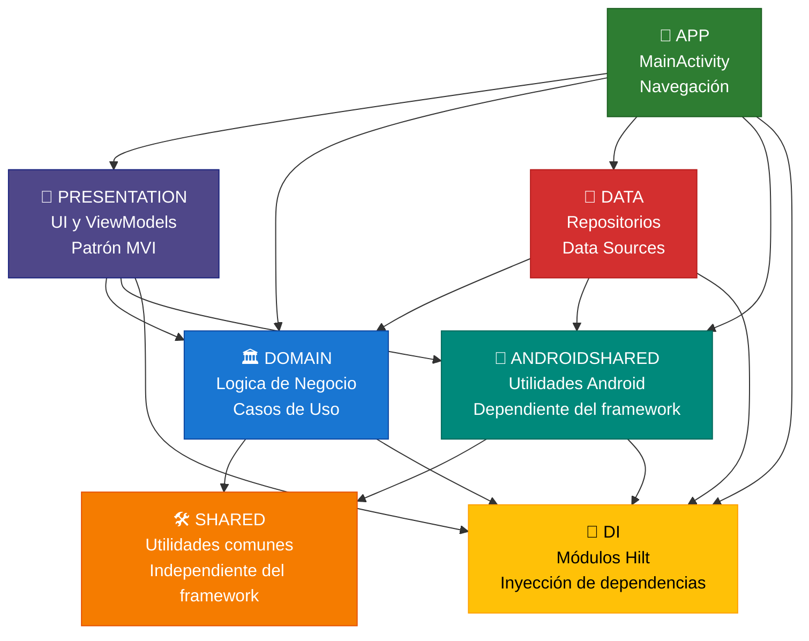

<div align="center">

# Civil Academy 🎓

<!-- Kotlin -->


<!-- Firebase -->


<!-- Android -->


<!-- Arquitectura -->


<!-- Herramientas -->


<!-- Licencia -->


**Una aplicación Android avanzada para la preparación de tests psicotécnicos en oposiciones**

*Actualmente en desarrollo con el sistema de autenticación implementado. Próximas funciones: entrenamiento adaptativo, contenido estructurado, seguimiento del progreso y planificación inteligente para ayudarte a superar tus oposiciones.*

</div>

---

## 📌 Índice de Contenidos

* [🌟 Descripción General](#-descripción-general)
* [🏗️ Arquitectura](#-arquitectura)
* [📊 Estado Actual del Proyecto](#-estado-actual-del-proyecto)
* [🚀 Primeros Pasos](#-empezando)
* [🔧 Configuración](#-configuración)
* [📱 Estructura de la App](#-estructura-de-la-app)
* [🧪 Estrategia de Testing](#-estrategia-de-testing)
* [🎨 Capturas y Demostración](#-capturas-y-demostración)
* [🔒 Seguridad y Privacidad](#-seguridad-y-privacidad)
* [🚢 Despliegue](#-despliegue)
* [📋 Hoja de Ruta](#-hoja-de-ruta)
* [📄 Licencia](#-licencia)
* [🆘 Soporte](#-soporte)

---

## 🌟 Descripción General

Civil Academy es una aplicación Android moderna diseñada para opositores. Construida con tecnologías de vanguardia y siguiendo las mejores prácticas de la industria, ofrece un ecosistema completo para la preparación de exámenes competitivos con experiencias de aprendizaje personalizadas.

La app combina entrenamiento psicotécnico con materiales de estudio, análisis detallado del progreso y planificación inteligente para maximizar la eficiencia del aprendizaje y las tasas de éxito.

---

## 🏗️ Arquitectura

### Implementación de Arquitectura Limpia

```
┌─ app/                          # Configuración principal y navegación
├─ presentation/                 # Capa de UI (Compose + ViewModels con MVI)
├─ domain/                       # Lógica de negocio y casos de uso
├─ data/                         # Fuentes de datos y repositorios
├─ androidshared/                # Utilidades dependientes de Android
├─ shared/                       # Utilidades independientes de la plataforma
└─ di/                           # Módulos de inyección de dependencias
```

### Stack Tecnológico

* **UI**: Jetpack Compose 2025.09.01 con Material 3
* **Arquitectura**: MVI + Arquitectura Limpia
* **Inyección de dependencias**: Hilt 2.57.2
* **Backend**: Firebase BOM 34.3.0 (Auth + Firestore + Analytics + Crashlytics)
* **Gestión de estado**: StateFlow + Channels
* **Asincronía**: Kotlin Coroutines 1.10.2 + Flow
* **Almacenamiento local**: DataStore 1.1.7
* **Herramientas de build**: Kotlin 2.2.20, AGP 8.12.3, KSP 2.2.20-2.0.2
* **Target SDK**: API 36 (Android 16)
* **Testing**: JUnit 4.13.2, Mockito 5.20.0, Turbine 1.2.1

---

## 📊 Estado Actual del Proyecto

### Funcionalidades Implementadas

- ✅ **Autenticación completa con Firebase**: Integración completa con Firebase Auth
- ✅ **Registro de usuario**: Registro con correo electrónico/contraseña con verificación
- ✅ **Inicio de sesión seguro**: Inicio de sesión seguro con verificación de correo electrónico
- ✅ **Persistencia de sesión**: La sesión permanece activa, por lo que no necesitas iniciar sesión cada vez que abres la aplicación
- ✅ **Recuperación de contraseña**: Recuperación de contraseña por correo electrónico
- ✅ **Arquitectura limpia**: Implementación de MVI + Arquitectura Limpia
- ✅ **UI moderna**: Jetpack Compose con diseño Material 3
- ✅ **Navegación**: Navegación segura entre pantallas
- ✅ **Inyección de dependencias**: Configuración de Hilt

### 🚧 En Desarrollo

- 🔄 **Tests psicotécnicos**: Sistema de tests adaptativos
- 🔄 **Contenido de estudio**: Materiales de aprendizaje estructurados
- 🔄 **Seguimiento del progreso**: Análisis del rendimiento del usuario
- 🔄 **Soporte offline**: Integración con base de datos Room

### 📋 Próximas Funcionalidades

- [ ] **Analítica avanzada**: Seguimiento del progreso multidimensional
- [ ] **Planificación inteligente**: Planes de estudio personalizados
- [ ] **Estudio colaborativo**: Sesiones de estudio en grupo
- [ ] **Soporte multilenguaje**: Localización extendida

---

## 🚀 Primeros Pasos

### Requisitos Previos
- Android Studio Koala (2024.1.1) o superior
- JDK 11 o superior
- Android SDK API 30+
- Proyecto Firebase configurado

### Configuración de Firebase

> ⚠️ **Importante**: Con la configuración de Firebase la app tendrá funcionalidad limitada.

1. **Crear proyecto Firebase**
   ```bash
   # Visita https://console.firebase.google.com/
   # Crea un proyecto nuevo o utiliza uno existente
   ```
2. **Habilitar servicios necesarios**
   * Autenticación (Correo y contraseña, google)
   * Analytics (opcional)

3. **Descargar configuración**
   ```bash
   # Descarga google-services.json
   # Colocalo en la raíz del proyecto
   ```

4. **Configurar autenticación**
   * Habilita proveedor de Email/Contraseña
   * Configura dominios autorizados
   * Configura reglas de seguridad

### Instalación

```bash
# Clona el repositorio
git clone https://github.com/tu-usuario/civil-academy.git

# Navega a la carpeta del proyecto
cd civil-academy

# Construye el proyecto
./gradlew build

# Prueba en un emulador
./gradlew installDebug
```

### Variantes de compilación

| Variante  | Propósito             | Requisitos                 |
| --------- | --------------------- | -------------------------- |
| `debug`   | Desarrollo y pruebas  | google-services.json       |
| `release` | Despliegue producción | Keystore + Config Firebase |

---

## 🔧 Configuración

### Con Firebase
La app puede compilarse parcialmente sin Firebase:
- ✅ Navegación
- ✅ UI de perfil y ajustes
- ✅ Interfaz de calendario
- ✅ Autenticación
- ❌ Tests psicotécnicos
- ❌ Contenido de estudio
- ❌ Seguimiento del progreso

### Configuración de desarrollo
```kotlin
android {
   buildTypes {
      debug {
         applicationIdSuffix = ".dev"
         versionNameSuffix = "-dev"
         isDebuggable = true
         // Añade la configuración específica en debug
      }
   }
}
```

---

## 📱 Estructura de la App

### Dependencias entre Módulos



### Componentes clave

#### Capa de presentación
- **Pantallas Compose**: UI declarativa moderna con Material 3
- **ViewModels**: Patrón MVI con StateFlow y Channels
- **Navegación**: Navegación segura con Kotlin Serialization
- **Sistema de temas**: Material 3 con soporte de temas dinámicos
- **Componentes personalizados**: Componentes de UI reutilizables (LoadingButton, CustomTextField)

#### Capa de dominio
- **Casos de uso**: Operaciones de negocio de única responsabilidad
- **Entidades**: Modelos centrales de negocio
- **Repositorios**: Abstracciones de acceso a datos
- **Validación**: Validación de entradas y reglas de negocio
- **Sin dependencias de Android**: Código puro Kotlin testeable

#### Capa de datos
- **Fuentes remotas**: Integraciones con Firebase
- **Fuentes locales**: DataStore para preferencias (Room planificado)
- **Implementaciones de repositorios**: Acceso a datos concreto
- **Mappers**: Transformación de datos entre capas
- **Manejo de errores**: Mapeo de errores completo

#### Capa de DI
- **Módulos Hilt**: Provisión centralizada de dependencias
- **Anotaciones personalizadas**: Alcance y calificación
- **Puntos de inyección**: Inyección en constructor, campo y método
- **Soporte multi-módulo**: Dependencias entre todos los módulos

#### Capa compartida
- **Funciones utilitarias**: Ayudantes independientes de la plataforma
- **Constantes**: Constantes globales de la aplicación
- **Clases base**: Componentes abstractos reutilizables
- **Definiciones de tipos**: Estructuras de datos y enums compartidos
- **Sin dependencias de Android**: Código puro Kotlin testeable

#### Capa AndroidShared
- **Puente de plataforma**: Conecta la lógica compartida con las APIs específicas de Android
- **Integración con Google Sign-In**: Proporciona interfaces para la autenticación con Google
- **Servicios dependientes del contexto**: Gestiona operaciones que requieren acceso al framework de Android
- **Abstracciones de interfaz**: Mantiene el código compartido libre de dependencias de Android
- **Cumplimiento de arquitectura limpia**: Preserva la separación de responsabilidades entre módulos

---

## 🧪 Estrategia de Testing

Civil Academy utiliza **tests unitarios** para la lógica de negocio (módulos JVM) y módulos Android, con **Jacoco** para la generación de reportes de cobertura.

### Tests Unitarios

#### Ejecutar todos los tests unitarios desde la raíz

Desde la raíz del proyecto, puedes ejecutar **todos los tests unitarios** a la vez:

- **Todos los módulos JVM juntos** (`:domain`, `:shared`):
  ```bash
  ./gradlew test
  ```

- **Todos los módulos Android juntos** (`:presentation`, `:data`, `:androidshared`):
  ```bash
  ./gradlew testDebugUnitTest
  ```

- **Generar reporte combinado de cobertura**:
  ```bash
  ./gradlew jacocoRootReport
  ```

- **Ejecutar todos los tests y generar el reporte combinado de cobertura**:
  ```bash
  ./gradlew test testDebugUnitTest jacocoRootReport
  ```

> `jacocoRootReport` depende de todas las tareas de test unitario y produce un **reporte combinado en formato HTML y XML** para los módulos Android y JVM. 
> Ubicaciones de los reportes:
> - HTML: `build/reports/jacocoRootReport/html/index.html`
> - XML: `build/reports/jacocoRootReport/report.xml` (for IntelliJ / CI)

#### Ejecutar tests por módulo

También puedes ejecutar los tests de un **módulo específico**:

- **Módulo JVM (`:domain`)**:
  ```bash
  ./gradlew :domain:test
  ```

- **Módulo Android (`:data`)**:
  ```bash
  ./gradlew :data:testDebugUnitTest
  ```

> Sustituye el nombre del módulo por el que desees testear.

#### Generar reporte de cobertura por módulo

Los reportes de cobertura también pueden generarse **por módulo** después de ejecutar los tests correspondientes:

- **Módulo JVM (`:domain`)**:
  ```bash
  # Primero, ejecutar tests
  ./gradlew :domain:test
  
  # Luego generar el reporte Jacoco
  ./gradlew :domain:jacocoJvmReport
  
  # Ejecutar tests y generar reporte Jacoco
  ./gradlew :domain:clean :domain:test :domain:jacocoJvmReport
  ```

- **Módulo Android (`:data`)**:
  ```bash
  # Primero, ejecutar tests
  ./gradlew :data:testDebugUnitTest
  
  # Luego generar el reporte Jacoco
  ./gradlew :data:jacocoAndroidReport
  
  # Ejecutar tests y generar reporte Jacoco
  ./gradlew :data:clean :data:testDebugUnitTest :data:jacocoAndroidReport
  ```

> Cada tarea de módulo genera reportes en formato HTML y XML en sus respectivos directorios build.  
> Ejemplo: `data/build/reports/jacoco/index.html`

#### Notas

- **Jacoco solo reporta tests unitarios**.
- Ejecuta los **tests primero** antes de generar los reportes.
- El reporte combinado raíz (`jacocoRootReport`) **incluye automáticamente todos los tests de los módulos** y produce un único reporte agregado de cobertura.

### Tests de Integración
```bash
# Ejecutar tests instrumentados
./gradlew connectedDebugAndroidTest
```
> ⚠️ **Estado**: En progreso.

### Tests de UI
```bash
# Ejecutar tests de UI con Compose
./gradlew :presentation:connectedDebugAndroidTest
```
> ⚠️ **Estado**: En progreso.

### Frameworks
- **JUnit 4.13.2**: Framework de Test
- **Mockito 5.20.0**: Framework para mock
- **Mockito-Kotlin 6.1.0**: Mock Kotlin
- **Turbine 1.2.1**: Utilidad para testear Flows
- **Truth 1.4.5**: Validaciones fluidas
- **Coroutines Test 1.10.2**: Utilidades de tetsing para Corrutinas

---

## 🎨 Capturas y Demostración

### Demo de la App (Modo Claro y Oscuro)
El siguiente demo muestra el flujo de splash, login y registro en modo claro y oscuro.

<p align="center">
  
</p>

### Desglose de Capturas de Pantalla
Capturas detalladas de splash, login y registro en modo claro y oscuro.

#### Modo Claro
<p align="center">
  
  &nbsp;&nbsp;&nbsp;
  
  &nbsp;&nbsp;&nbsp;
  
</p>

#### Modo Oscuro
<p align="center">
  
  &nbsp;&nbsp;&nbsp;
  
  &nbsp;&nbsp;&nbsp;
  
</p>

### Componentes Interactivos

#### Sistema de Botones Personalizados
- **Estados de Carga**: Animaciones suaves durante las operaciones
- **Feedback de Éxito/Fallo**: Confirmación visual de los resultados
- **Accesibilidad**: Soporte completo para VoiceOver y TalkBack
- **Material 3**: Sigue las últimas guías de diseño

#### Entradas de Texto Inteligentes
- **Validación en Tiempo Real**: Retroalimentación instantánea con patrón MVI
- **Manejo de Errores**: Mensajes claros y accionables
- **Gestión de Contraseñas**: Entrada segura con opción de mostrar/ocultar
- **Optimización de Teclado**: Tipos de entrada apropiados al contexto
- **Gestión de Foco**: Transiciones de foco suaves

#### Sistema de Diálogos de Soporte de Validación
- **Componentes Reutilizables**: Diálogo genérico con validación de campos
- **Integración MVI**: Comportamiento del diálogo dirigido por estado
- **Flujos de Confirmación**: Diálogos para cambio de email y restablecimiento de contraseña
- **Soporte de Validación**: Múltiples tipos de campos con validación en tiempo real

---

## 🔒 Seguridad y Privacidad

### Protección de Datos
- **Cifrado de Extremo a Extremo**: Cifrado de Firebase para datos en reposo y en tránsito
- **Cumplimiento GDPR**: Control de datos de usuario y derechos de eliminación
- **Permisos Mínimos**: Solo se solicitan permisos esenciales
- **Almacenamiento Seguro**: DataStore con cifrado para datos sensibles
- **Validación de Entrada**: Validación en múltiples capas (UI, ViewModel, UseCase)
- **ProGuard**: Ofuscación de código en compilaciones de release

### Privacidad
- **Firebase Analytics**: Analítica de uso anónima (opcional)
- **Eliminación de Cuenta**: Los usuarios pueden eliminar sus cuentas y datos
- **Comunicación Segura**: Cifrado HTTPS para todas las solicitudes de red
- **Datos Locales**: Preferencias almacenadas de forma segura en el dispositivo
- **Sin Seguimiento**: No se incluyen SDKs de terceros para publicidad o tracking
- **Crashlytics**: Reporte de fallos opt-in sin PII

### Mejores Prácticas de Seguridad
- **Requisitos de Contraseña**: Validación de contraseñas fuerte
- **Verificación de Email**: Verificación de correo obligatoria para el registro
- **Gestión de Sesion**: Manejo seguro de tokens
- **Mensajes de Error**: Mensajes genéricos para evitar divulgación de información

---

## 🚢 Despliegue

### Proceso de Release
1. **Incremento de Versión**: Actualizar código de versión y nombre
2. **Pruebas**: Ejecución completa del suite de pruebas
3. **Firma**: Firma con keystore de producción
4. **Distribución**: Despliegue en Google Play Store

### Gestión del Keystore
```bash
# El keystore de producción es requerido para compilaciones de release
# No incluido en el repositorio por razones de seguridad
```

---

## 📋 Hoja de Ruta

### Entrenamiento Psicotećnico
- [ ] **Dificultad Adaptativa**: Complejidad progresiva de los tests basada en el rendimiento
- [ ] **Múltiples Tipos de Test**: Lógica, razonamiento numérico, percepción espacial
- [ ] **Retroalimentación Instantánea**: Explicaciones detalladas de respuestas incorrectas

### Sistema de Estudio
- [ ] **Contenido Organizado**: Estructura jerárquica de los temas
- [ ] **Acceso Offline**: Descargar materiales para estudio sin internet
- [ ] **Sincronización de Progreso**: Continuidad de aprendizaje entre dispositivos

### Analítica Avanzada
- [ ] **Progreso Multi-dimensional**: Seguimiento de habilidades en diferentes áreas
- [ ] **Insights de Rendimiento**: Identificar fortalezas y áreas de mejora
- [ ] **Reportes Visuales**: Gráficos interactivos y análisis de tendencias
- [ ] **Analítica Comparativa**: Comparar desempeño con otros usuarios

### Funcionalidades Futuras
- [ ] **Grupos de Estudio Colaborativos**: Sesiones de estudio en tiempo real
- [ ] **Comandos de Voz**: Navegación y estudio manos libres
- [ ] **Soporte Multilenguaje**: Localización para audiencia global (actualmente solo inglés y español)

### Mejoras Técnicas
- [ ] **Testing**: Implementar pruebas integradas completas
- [ ] **CI/CD**: Configurar pipeline de pruebas y despliegue automatizado
- [ ] **Rendimiento**: Optimizar rendimiento de la app y uso de memoria

---

## 📄 Licencia

Proyecto bajo licencia educativa personalizada - ver archivo [LICENSE.txt](LICENSE.text) para más detalles.

### Resumen de la Licencia
- ✅ **Permitido**: Uso personal, aprendizaje y modificación con fines educativos
- ❌ **Prohibido**: Uso comercial, redistribución y publicación en tiendas

---

## 🆘 Soporte

### Contacto
- **Correo:** fmdevpro@gmail.com

---

##### Este README también está disponible en [Inglés](README.md)

<div align="center">

**Hecho con ❤️ para futuros funcionarios públicos**

*⭐ Si este proyecto te ha inspirado o ayudado, deja una estrella. ¡Es la mejor forma de apoyar su desarrollo!*

</div>
