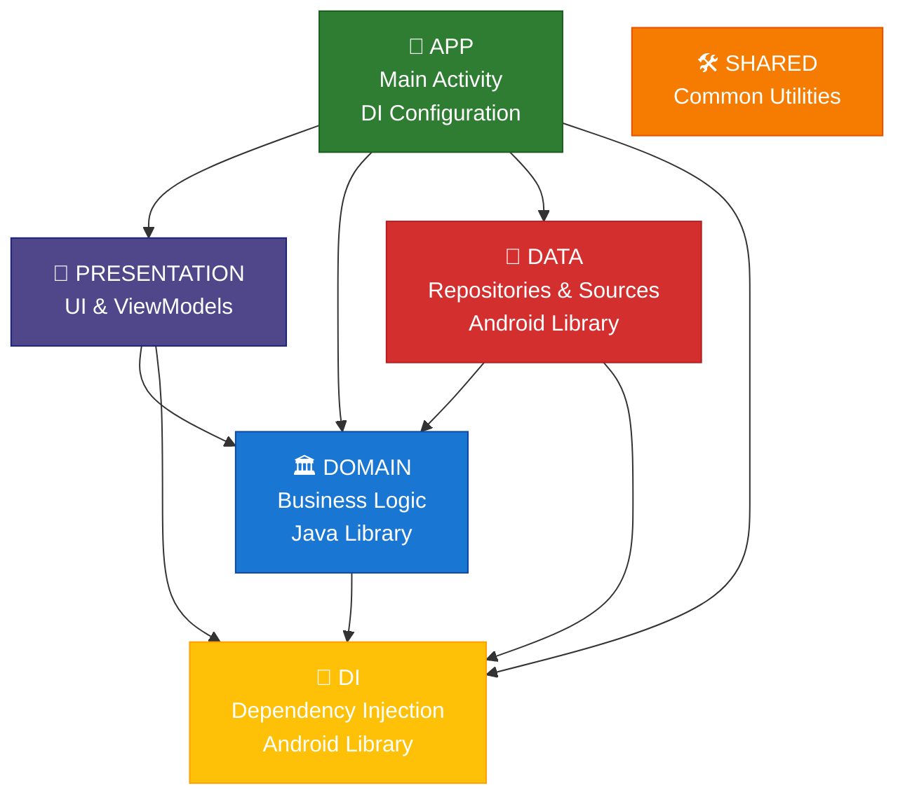
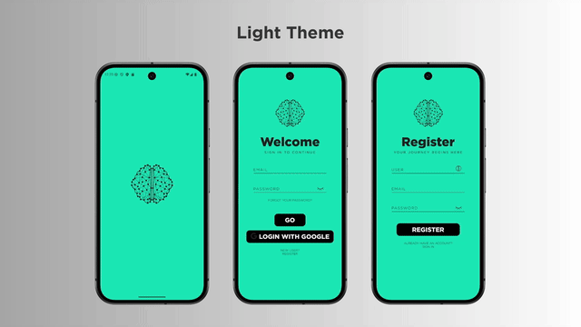
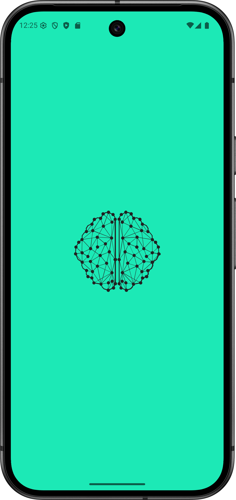
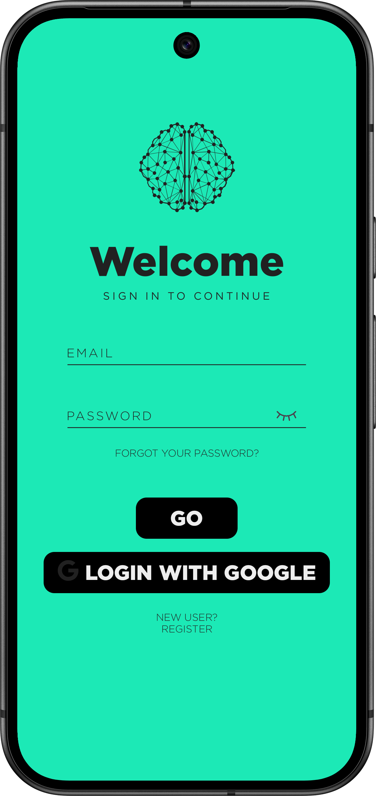
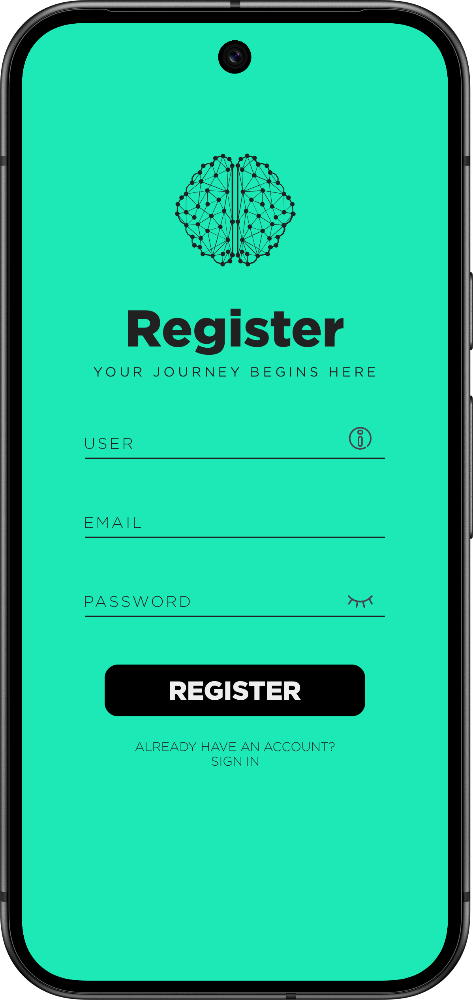
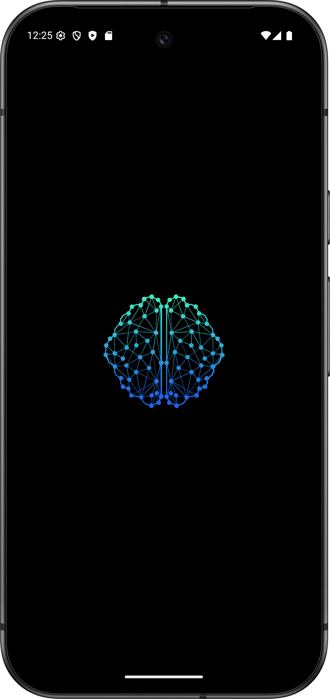
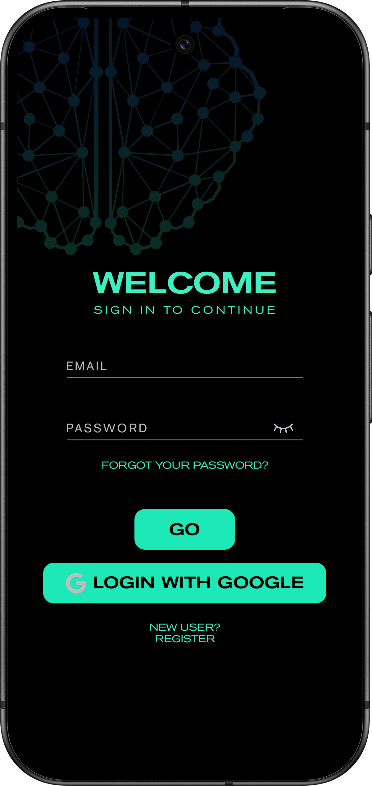
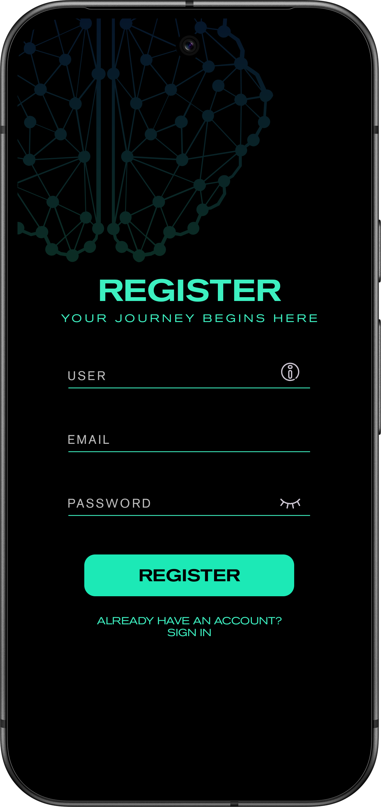

<div align="center">

# Civil Academy 🎓

<!-- Kotlin -->


<!-- Firebase -->


<!-- Android -->


<!-- Architecture -->


<!-- Tools -->


<!-- License -->


**An advanced Android app for competitive psychotechnical test preparation in civil service exams**

*Currently in development with authentication system implemented. Incoming features include adaptive training, structured study content, progress tracking, and smart scheduling to help you succeed in public sector entrance exams*

</div>

---

## 📌 Table of Contents

- [🌟 Overview](#-overview)
- [🏗️ Architecture](#-architecture)
- [📊 Current Project Status](#-current-project-status)
- [🚀 Getting Started](#-getting-started)
- [🔧 Configuration](#-configuration)
- [📱 App Structure](#-app-structure)
- [🧪 Testing Strategy](#-testing-strategy)
- [🎨 Screenshots & Demo](#-screenshots--demo)
- [🔒 Security & Privacy](#-security--privacy)
- [🚢 Deployment](#-deployment)
- [📋 Roadmap](#-roadmap)
- [📄 License](#-license)
- [🆘 Support](#-support)

---

## 🌟 Overview

Civil Academy is a modern Android application designed specifically for competitive exam candidates. Built with cutting-edge technologies and following industry best practices, it offers a complete ecosystem for exam preparation with personalized learning experiences.

The app combines psychotechnical test training with comprehensive study materials, detailed progress analytics, and smart scheduling to maximize learning efficiency and exam success rates.

---

## 🏗️ Architecture

### Clean Architecture Implementation
```
┌─ app/                          # Main configuration & navigation
├─ presentation/                 # UI layer (Compose + ViewModels)
├─ domain/                       # Business logic & use cases
├─ data/                         # Data sources & repositories
└─ shared/                       # Centralized common utilities
```

### Tech Stack
- **🎨 UI Framework**: Jetpack Compose with Material 3 Design
- **🏛️ Architecture**: MVVM + Clean Architecture
- **🔧 Dependency Injection**: Hilt 2.57.1
- **☁️ Backend**: Firebase BOM 34.3.0 (Auth + Firestore + Storage)
- **📊 State Management**: Compose State + StateFlow
- **🔄 Async Operations**: Kotlin Coroutines 1.10.2 + Flow
- **🔨 Build Tools**: Kotlin 2.2.20, AGP 8.12.3
- **📱 Target SDK**: API 36 (Android 14)

---

## 📊 Current Project Status

### Implemented Features
- ✅ **Authentication System**: Complete Firebase Auth integration
- ✅ **User Registration**: Email/password registration with verification
- ✅ **Login System**: Secure login with email verification check
- ✅ **Session Persistence**: The session remains active so you don't need to log in every time you open the app.
- ✅ **Password Reset**: Email-based password recovery
- ✅ **Clean Architecture**: MVVM + Clean Architecture implementation
- ✅ **Modern UI**: Jetpack Compose with Material 3 Design
- ✅ **Navigation**: Type-safe navigation between screens
- ✅ **Dependency Injection**: Hilt configuration

### 🚧 In Development
- [ ] **Psychotechnical Tests**: Adaptive test system
- [ ] **Study Content**: Structured learning materials
- [ ] **Progress Tracking**: User performance analytics
- [ ] **Offline Support**: Room database integration

### 📋 Planned Features
- [ ] **Advanced Analytics**: Multi-dimensional progress tracking
- [ ] **Smart Scheduling**: Personalized study plans
- [ ] **Collaborative Study**: Group study sessions
- [ ] **Multi-language Support**: Extended localization

---

## 🚀 Getting Started

### Prerequisites
- Android Studio Koala (2024.1.1) or later
- JDK 11 or higher
- Android SDK API 30+
- Firebase project

### Firebase Setup

> ⚠️ **Important**: With Firebase configuration, the app will have limited functionality

1. **Create Firebase Project**
   ```bash
   # Visit https://console.firebase.google.com/
   # Create new project or use existing one
   ```

2. **Enable Required Services**
   - Authentication (Email/Password, Google Sign-In)
   - Analytics (optional)

3. **Download Configuration**
   ```bash
   # Download google-services.json
   # Place in app/ directory
   ```

4. **Configure Authentication**
   - Enable Email/Password provider
   - Configure authorized domains
   - Set up security rules

### Installation

```bash
# Clone the repository
git clone https://github.com/your-username/civil-academy.git

# Navigate to project directory
cd civil-academy

# Build the project
./gradlew build

# Run on connected device/emulator
./gradlew installDebug
```

### Build Variants

| Variant   | Purpose               | Requirements               |
|-----------|-----------------------|----------------------------|
| `debug`   | Development & testing | google-services.json       |
| `release` | Production deployment | Keystore + Firebase config |

---

## 🔧 Configuration

### With Firebase
The app can still be compiled and partially explored with Firebase:
- ✅ Navigation between screens
- ✅ Profile and Settings UI
- ✅ Calendar interface (no data)
- ✅ Authentication
- ❌ Psychotechnical tests
- ❌ Study content
- ❌ Progress tracking
- ❌ Statistics

### Development Setup
```kotlin
// In app/build.gradle.kts
android {
   buildTypes {
      debug {
         applicationIdSuffix = ".dev"
         versionNameSuffix = "-dev"
         isDebuggable = true
         // Add debug-specific configuration
      }
   }
}
```

---

## 📱 App Structure

### Module Dependencies


### Key Components

#### 🎨 Presentation Layer
- **Compose Screens**: Modern declarative UI
- **ViewModels**: State management and business logic orchestration
- **Navigation**: Type-safe navigation with arguments
- **Theme System**: Material 3 with dynamic theming

#### 🏛️ Domain Layer
- **Use Cases**: Single-responsibility business operations
- **Entities**: Core business models
- **Repositories**: Data access abstractions
- **Validation**: Input validation and business rules

#### 💾 Data Layer
- **Remote Sources**: Firebase integrations
- **Local Sources**: Room database for offline support
- **Mappers**: Data transformation between layers
- **Caching**: Intelligent data caching strategies

#### 💉 DI Layer
- **Hilt Modules**: Centralized dependency provision
- **Custom Annotations**: Scoping and qualification
- **Injection Points**: Constructor, field, and method injection

#### 🛠️ Shared Layer
- **Utility Functions**: Common helpers and extensions
- **Constants**: Global application constants
- **Base Classes**: Reusable abstract components
- **Type Definitions**: Shared data structures and enums

---

## 🧪 Testing Strategy

### Unit Tests
```bash
# Run unit tests
./gradlew testDebugUnitTest

# Generate coverage report
./gradlew jacocoTestDebugUnitTestReport
# Note: JaCoCo coverage reporting not yet configured, will be added in future versions
```

### Integration Tests
```bash
# Run instrumented tests
./gradlew connectedDebugAndroidTest
```

### UI Tests
```bash
# Run Compose UI tests
./gradlew :presentation:connectedDebugAndroidTest
```

---

## 🎨 Screenshots & Demo

### 🎥 App Demo (Light & Dark Mode)
The following demo showcases the splash, login and register flow in both light and dark mode.

<p align="center">
  
</p>

### 📱 Screenshots Breakdown
Detailed screenshots of splash, login and register in light and dark mode.

#### Light Mode
<p align="center">
  
  &nbsp;&nbsp;&nbsp;
  
  &nbsp;&nbsp;&nbsp;
  
</p>

#### Dark Mode
<p align="center">
  
  &nbsp;&nbsp;&nbsp;
  
  &nbsp;&nbsp;&nbsp;
  
</p>

### Interactive Components

#### Custom Button System
- **Loading States**: Smooth animations during operations
- **Success/Failure Feedback**: Visual confirmation of actions
- **Accessibility**: Full VoiceOver and TalkBack support
- **Material 3**: Follows latest design guidelines

#### Smart Text Inputs
- **Real-time Validation**: Instant feedback on input
- **Error Handling**: Clear, actionable error messages
- **Password Management**: Secure input with visibility toggle
- **Keyboard Optimization**: Context-appropriate input types

---

## 🔒 Security & Privacy

### Data Protection
- **End-to-End Encryption**: Sensitive data encrypted at rest and in transit
- **GDPR Compliance**: Full user data control and deletion rights
- **Minimal Permissions**: Only essential permissions requested
- **Secure Storage**: Keystore integration for sensitive data
- **Input Validation**: Client-side validation for user inputs

### Privacy Features
- **Firebase Analytics**: Anonymous usage analytics (optional)
- **User Control**: Users can delete their accounts
- **Secure Communication**: HTTPS encryption for all network requests
- **Local Data**: User preferences stored securely on device

---

## 🚢 Deployment

### Release Process
1. **Version Bump**: Update version code and name
2. **Testing**: Full test suite execution
3. **Signing**: Production keystore signing
4. **Distribution**: Google Play Store deployment

### Keystore Management
```bash
# Production keystore is required for release builds
# Not included in repository for security reasons
# Contact maintainers for authorized deployments
```

---

## 📋 Roadmap

### 🧠 Psychotechnical Training
- [ ] **Adaptive Difficulty**: Progressive test complexity based on performance
- [ ] **Multiple Test Types**: Logic, numerical reasoning, spatial awareness
- [ ] **Instant Feedback**: Detailed explanations for incorrect answers

### 📚 Study System
- [ ] **Organized Content**: Hierarchical topic structure
- [ ] **Offline Access**: Download materials for study without internet
- [ ] **Progress Synchronization**: Cross-device learning continuity

### 📈 Advanced Analytics
- [ ] **Multi-dimensional Progress**: Track skills across different areas
- [ ] **Performance Insights**: Identify strengths and improvement areas
- [ ] **Visual Reports**: Interactive charts and trend analysis
- [ ] **Comparative Analytics**: Benchmark against peer performance

### Upcoming Features
- [ ] **Collaborative Study Groups**: Real-time group study sessions
- [ ] **Voice Commands**: Hands-free navigation and study
- [ ] **Multi-language Support**: Localization for global audience (now only English and Spanish support)

### Technical Improvements
- [ ] **Testing**: Implement comprehensive unit and integration tests
- [ ] **Code Coverage**: Add JaCoCo reporting and achieve 90%+ coverage
- [ ] **CI/CD**: Set up automated testing and deployment pipeline
- [ ] **Performance**: Optimize app performance and memory usage

---

## 📄 License

This project is licensed under a custom educational license - see the [LICENSE.txt](LICENSE.txt) file for details.

### License Summary
- ✅ **Permitted**: Personal use, learning, modification for education
- ❌ **Prohibited**: Commercial use, redistribution, store publication

---

## 🆘 Support

### Contact
- **Email**: fmdevpro@gmail.com

---

##### This README is also available in [Spanish](README.es.md)

<div align="center">

**Made with ❤️ for aspiring civil servants**

*⭐ If this project inspired, helped, or just looked good to you, consider leaving a star — it's a great way to support its development!*

</div>